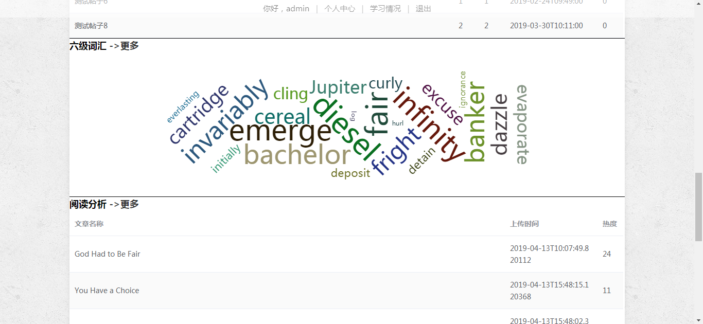
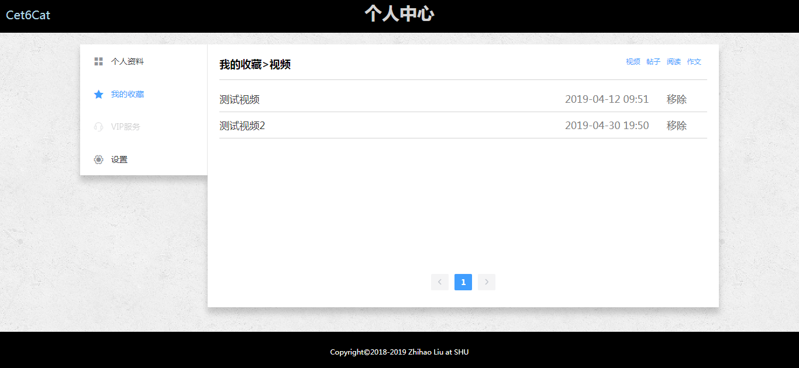
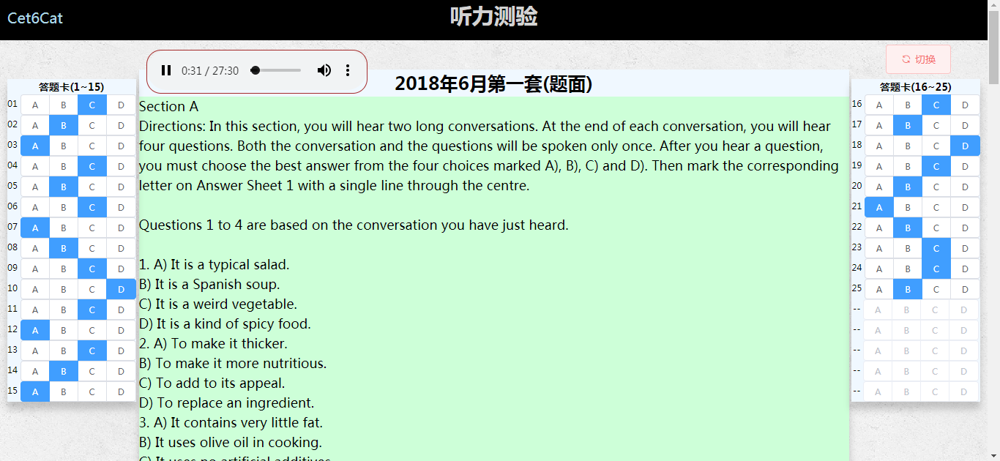

# CET6Cat_Front
CET6Cat英语六级辅导网前端，Vue.js+ElementUI+Echarts。


## 后端项目地址
[CET6Cat_Back](https://github.com/LauZyHou/CET6Cat_Back)

## 演示视频
[CET6Cat演示视频-bilibili](https://www.bilibili.com/video/av63516010/)

## 前端运行展示
### 注册页

### 登录页

### 首页




### 个人中心
#### 个人资料


#### 我的收藏
在右上角可以切换收藏类型。

### 用户主页
可以查看其他用户的信息，并对其关注和取关。

### 充值页

### 在线视频
#### list页

#### 详情页

### 阅读分析
#### list页

#### 详情页

### 交流论坛
#### list页

#### 详情页 & 回帖


#### 发帖

### 高分作文
#### list页

#### 详情页

### 背单词页
可以每日打卡以记录背诵进度。

### 单词测验
#### 交卷前(测验)

#### 交卷后(展示答案)
交卷后，服务器会记录此次测验的错误单词。

### 听力测验
#### list页

#### 测验页
在左右答题卡上作答。

可以随时切换至答案，以完成自测。

### 翻译测验
#### list页

#### 测验页
在下方文本区域作答，可以随时保存答卷至服务器数据库中，每次进入将取出存档。

可以随时切换至答案，以完成自测。

### 全局搜索
例如，这是对“测试”二字模糊搜索的部分结果。


### 学习情况展示


### 关注与粉丝
可以在个人资料页或用户主页点击相应的数字进入查看。


## 项目构建
```
npm install
```

## 项目运行
```
npm run dev
```
